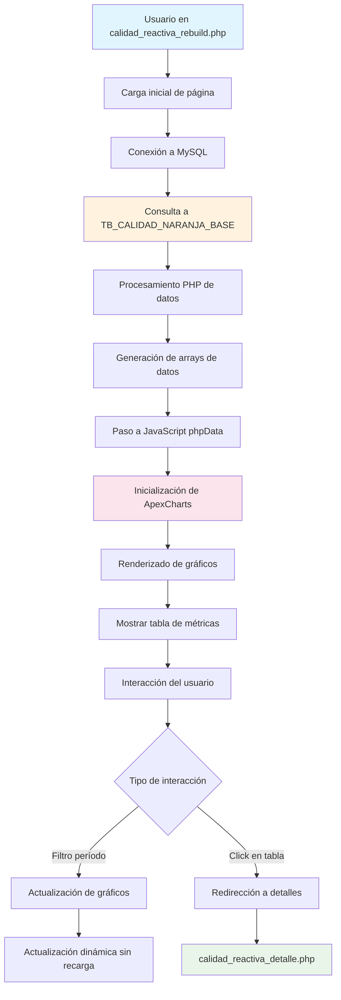
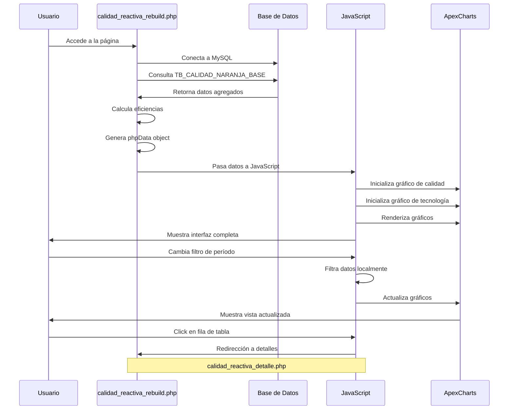
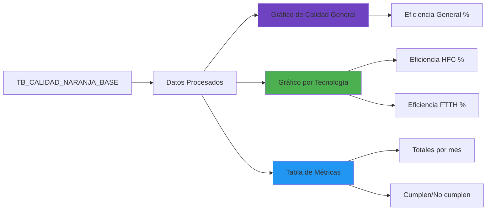
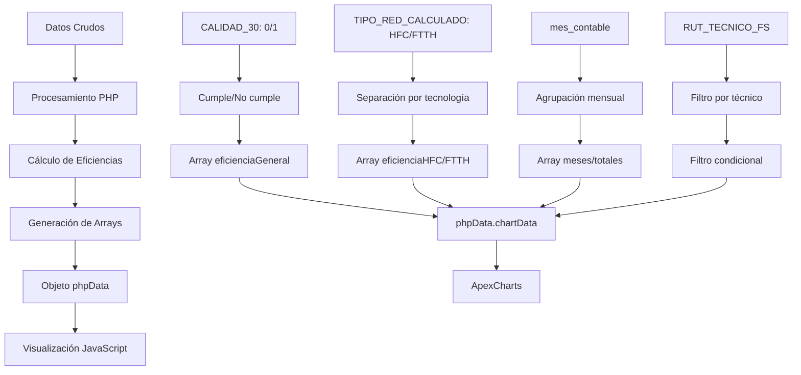

# Diagrama de Flujo de Información - Sistema de Calidad Reactiva

## Diagrama de Arquitectura



## Flujo de Datos Detallado

### 1. Capa de Datos (Base de Datos)
```
TB_CALIDAD_NARANJA_BASE (58 campos)
├── Información de Identificación
│   ├── LLAVE1
│   ├── num_pedido, num_pedido_2
│   └── ORDEN_CALIDAD_*
├── Información del Técnico
│   ├── RUT_TECNICO_FS, RUT_TECNICO_FS_2
│   ├── DESC_EMPRESA, DESC_EMPRESA_2
│   └── Empresa_Homologada
├── Información del Cliente
│   ├── id_cliente
│   ├── nombre_cuenta
│   ├── tipo_cuenta
│   └── tipo_cliente
├── Información Geográfica
│   ├── ZONA, ZONA2
│   ├── Comuna
│   ├── codi_localidad
│   ├── bucket, Nombre_Bucket
├── Información de Actividades
│   ├── ACTIVIDAD, ACTIVIDAD_FINAL
│   ├── TIPO_ACTIVIDAD
│   ├── id_actividad, id_actividad_2
│   └── descripcion_actividad*
├── Información Temporal
│   ├── FECHA_CREACION_PEDIDO
│   ├── FECHA_EJECUCION
│   ├── FECHA_AGENDAMIENTO
│   ├── DIA_EJE, MES_EJE, AÑO_EJE
│   └── mes_contable
├── Información de Calidad
│   ├── CALIDAD_30, CALIDAD_60, CALIDAD_7
│   ├── CALIDAD_15, CALIDAD_3
│   └── ORDEN_CALIDAD_*
└── Información Adicional
    ├── estado_pedido, ESTADO_TOA
    ├── TIPO_RED, TIPO_RED_PRODUCTO , TIPO_RED_CALCULADO
    ├── Base, Delivery
    └── DIFERENCIA_DIAS
```

### 2. Capa de Lógica de Negocio (PHP)
```
calidad_reactiva_rebuild.php
├── Conexión a base de datos
├── Consulta SQL principal
├── Procesamiento de resultados
├── Cálculo de eficiencias
├── Generación de arrays JavaScript
└── Renderizado HTML inicial
```

#### Consulta SQL Principal
```sql
SELECT
    YEAR(mes_contable) as anio,
    MONTH(mes_contable) as mes,
    mes_contable,
    COUNT(*) as total,
    SUM(CASE WHEN `CALIDAD_30` = '0' THEN 1 ELSE 0 END) as cumple,
    SUM(CASE WHEN `CALIDAD_30` = '1' THEN 1 ELSE 0 END) as no_cumple,
    SUM(CASE WHEN `CALIDAD_30` = '0' AND `TIPO_RED_CALCULADO` = 'HFC' THEN 1 ELSE 0 END) as cumple_hfc,
    SUM(CASE WHEN `CALIDAD_30` = '1' AND `TIPO_RED_CALCULADO` = 'HFC' THEN 1 ELSE 0 END) as no_cumple_hfc,
    SUM(CASE WHEN `CALIDAD_30` = '0' AND `TIPO_RED_CALCULADO` IN ('FTTH', 'DUAL') THEN 1 ELSE 0 END) as cumple_ftth,
    SUM(CASE WHEN `CALIDAD_30` = '1' AND `TIPO_RED_CALCULADO` IN ('FTTH', 'DUAL') THEN 1 ELSE 0 END) as no_cumple_ftth
FROM TB_CALIDAD_NARANJA_BASE
WHERE `RUT_TECNICO_FS` = ?
GROUP BY mes_contable
ORDER BY mes_contable
```

### 3. Capa de Presentación (JavaScript)
```
calidad_reactiva_rebuild.js
├── Inicialización de gráficos
├── Configuración de filtros
├── Manejo de interacciones
├── Actualización dinámica
└── Navegación a detalles
```

## Secuencia de Interacción



## Mapeo de Campos a Visualizaciones

### Campos Principales en Gráficos


### Transformación de Datos


## Componentes de la Interfaz

### 1. Estructura HTML Principal
```html
<div class="app-container">
    <div id="mainView" class="view active">
        <header class="app-header">
            <h1>Calidad Reactiva (Reconstrucción)</h1>
            <div class="user-info">RUT: [técnico]</div>
        </header>

        <div class="content-container">
            <!-- Sección de gráficos -->
            <div class="chart-section">
                <div id="calidadReactivaChart"></div>
                <div id="tecnologiaChart"></div>
                <!-- Filtros de período -->
            </div>

            <!-- Sección de tabla -->
            <div class="table-section">
                <table class="data-table">
                    <!-- Datos dinámicos -->
                </table>
            </div>
        </div>
    </div>

    <div id="detailsView" class="view">
        <!-- Vista de detalles (slide-in) -->
    </div>
</div>
```

### 2. Configuración de Gráficos ApexCharts

#### Gráfico Principal - Calidad Reactiva
```javascript
{
    series: [{
        name: 'Calidad Reactiva',
        data: [85.5, 87.2, 89.1, ...]
    }],
    chart: {
        type: 'line',
        height: 400,
        background: 'transparent',
        colors: ['#6f42c1'] // Púrpura
    },
    yaxis: {
        title: { text: 'Eficiencia (%)' },
        min: 0,
        max: 100
    }
}
```

#### Gráfico Secundario - Tecnología
```javascript
{
    series: [
        { name: 'HFC', data: [82.1, 84.3, 85.7, ...] },
        { name: 'FTTH', data: [88.2, 89.8, 91.4, ...] }
    ],
    chart: {
        type: 'line',
        height: 350,
        colors: ['#4CAF50', '#2196F3'] // Verde, Azul
    }
}
```

### 3. Sistema de Filtros
```javascript
// Botones de período
const buttons = {
    12: document.getElementById('monthsFilter12'),
    6: document.getElementById('monthsFilter6'),
    3: document.getElementById('monthsFilter3')
};

// Lógica de filtrado
function getFilteredData(months) {
    const totalMonths = data.meses.length;
    const start = Math.max(0, totalMonths - months);

    return {
        meses: data.meses.slice(start),
        eficienciaGeneral: data.eficienciaGeneral.slice(start),
        eficienciaHFC: data.eficienciaHFC.slice(start),
        eficienciaFTTH: data.eficienciaFTTH.slice(start)
    };
}
```

## Flujo de Navegación a Detalles

### 1. Interacción en Tabla
```javascript
tableBody.addEventListener('click', function (e) {
    const row = e.target.closest('tr');
    if (row && row.hasAttribute('data-mes')) {
        const mes = row.getAttribute('data-mes');
        const mesCompleto = row.getAttribute('data-mes-completo');
        showDetails(mes, mesCompleto);
    }
});

async function showDetails(mes, mesCompleto) {
    // Redirección a página de detalles
    window.location.href = `calidad_reactiva_detalle.php?mes=${encodeURIComponent(mes)}&mes_completo=${encodeURIComponent(mesCompleto)}`;
}
```

### 2. Parámetros de URL
```
calidad_reactiva_detalle.php
├── mes: "2025-10" (formato YYYY-MM)
├── mes_completo: "2025-10-01" (formato YYYY-MM-DD)
└── [otros parámetros de sesión]
```

## Consideraciones de Rendimiento

### 1. Optimización del Lado del Servidor
- **Agrupación SQL**: `GROUP BY mes_contable` reduce registros
- **Índices**: En `mes_contable` y `RUT_TECNICO_FS`
- **Consultas preparadas**: Previenen inyección SQL
- **Caching**: Datos procesados una vez por carga

### 2. Optimización del Lado del Cliente
- **Filtrado local**: Sin recargas al cambiar período
- **Actualización incremental**: Solo datos necesarios
- **Lazy loading**: Gráficos inicializadas cuando sea necesario
- **Event delegation**: Un solo listener para tabla dinámica

### 3. Manejo de Datos Masivos
```php
// Límite de registros para rendimiento
if (count($datosCalidad) > 24) {
    // Mantener solo últimos 2 años
    $datosCalidad = array_slice($datosCalidad, -24);
}
```

## Flujo de Errores y Logging

### 1. Logging en Servidor
```php
function logToFile($message, $type = 'INFO', $data = null) {
    $logFile = __DIR__ . '/logs/calidad_reactiva_rebuild.log';
    $timestamp = date('Y-m-d H:i:s');
    $formattedMessage = "[$timestamp] [$type] $message";
    if ($data !== null) { 
        $formattedMessage .= " - Data: " . json_encode($data, JSON_UNESCAPED_UNICODE); 
    }
    $ip = $_SERVER['REMOTE_ADDR'] ?? 'Unknown';
    $formattedMessage .= " - IP: $ip" . PHP_EOL;
    file_put_contents($logFile, $formattedMessage, FILE_APPEND);
}
```

### 2. Manejo de Errores en JavaScript
```javascript
// Validación de datos
if (typeof phpData === 'undefined') {
    console.error('phpData is not defined. Charts cannot be initialized.');
    return;
}

// Manejo de contenedores no encontrados
const calidadContainer = document.querySelector("#calidadReactivaChart");
if (!calidadContainer) {
    console.error('El contenedor #calidadReactivaChart no existe en el DOM');
    return;
}
```

## Arquitectura de Escalabilidad

### 1. Separación de Responsabilidades
- **PHP**: Procesamiento de datos y lógica de negocio
- **JavaScript**: Presentación e interacciones
- **MySQL**: Almacenamiento y consultas optimizadas
- **CSS**: Estilos y responsive design

### 2. Modularidad
```
calidad_reactiva_rebuild.php
├── Conexión a DB
├── Consultas SQL
├── Procesamiento de datos
└── Renderizado inicial

js/calidad_reactiva_rebuild.js
├── Configuración de gráficos
├── Manejo de filtros
├── Actualizaciones dinámicas
└── Navegación

css/calidad_reactiva.css
├── Estilos de gráficos
├── Diseño responsive
└── Animaciones y transiciones
```

### 3. Puntos de Extensión
- **Nuevas métricas**: `CALIDAD_60`, `CALIDAD_7`, `CALIDAD_15`
- **Filtros adicionales**: Por zona, por tipo de actividad
- **Exportación de datos**: CSV, PDF, Excel
- **Integraciones**: API externas, notificaciones
- **Dashboard en tiempo real**: WebSocket o Server-Sent Events