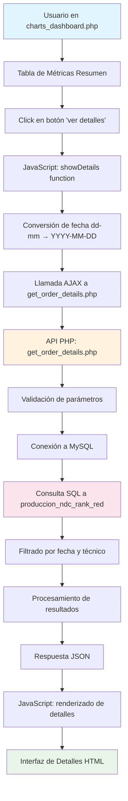
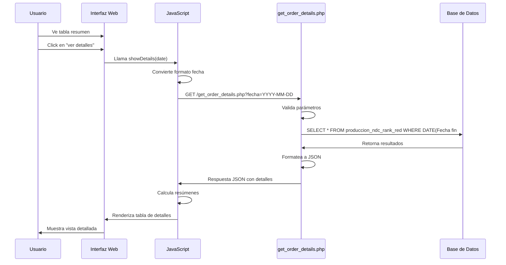
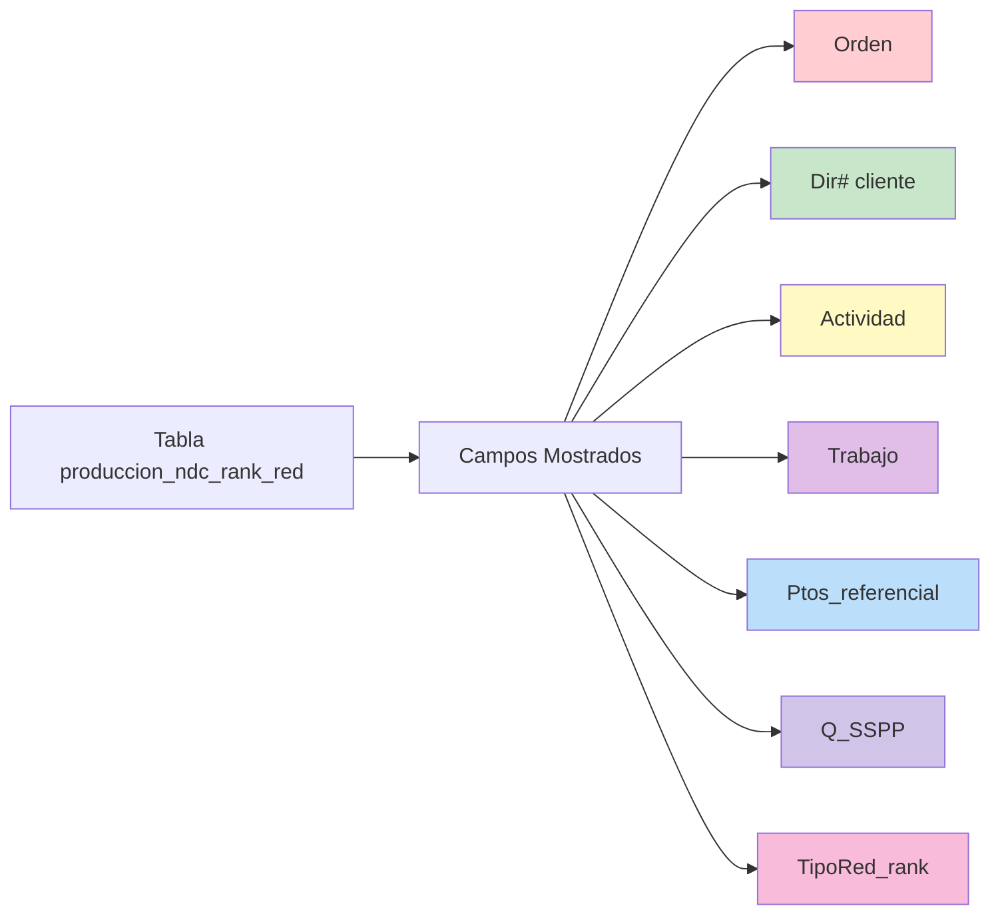
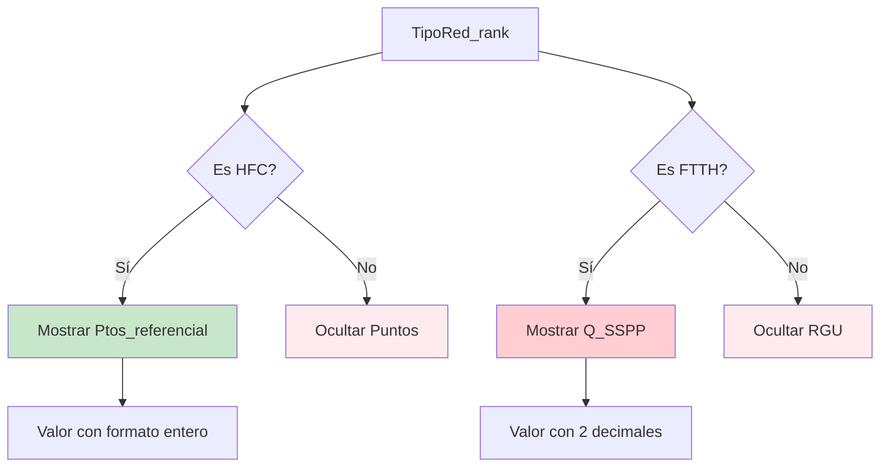

# Estructura de Datos - Detalle de Órdenes desde charts_dashboard.php

## Flujo de Información

### 1. Origen de Datos
- **Tabla Principal**: `produccion_ndc_rank_red`
- **Base de Datos**: `operaciones_tqw` (MySQL)
- **Conexión**: Host 170.239.85.233:3306

### 2. Flujo del Sistema
```
charts_dashboard.php (tabla resumen)
    ↓ (click en botón "ver detalles")
showDetails() function (JavaScript)
    ↓ (llamada AJAX)
get_order_details.php (API)
    ↓ (consulta SQL)
produccion_ndc_rank_red (tabla completa)
    ↓ (respuesta JSON)
Interfaz de Detalles (HTML dinámico)
```

## Estructura Completa de Campos

### Campos Principales Utilizados en el Detalle

#### Campos Mostrados en la Tabla de Detalles:
1. **Orden** (`Orden`) - Identificador único de la orden
2. **Dirección Cliente** (`Dir# cliente`) - Dirección del cliente
3. **Actividad** (`Actividad`) - Tipo de actividad realizada
4. **Trabajo** (`Trabajo`) - Descripción del trabajo
5. **Puntos** (`Ptos_referencial`) - Puntos referenciales (solo para HFC)
6. **RGU** (`Q_SSPP`) - Unidades de servicio (solo para FTTH)
7. **Tipo Red** (`TipoRed_rank`) - Tipo de red (HFC/FTTH)

#### Campos Adicionales Disponibles (no mostrados pero consultados):
8. **RGU** (`RGU`) - Campo RGU adicional
9. **Fecha fin#** (`Fecha fin#`) - Fecha y hora de finalización

### Campos Completos de la Tabla (43 campos totales)

#### Información de Identificación:
- `Empresa` - Empresa responsable
- `Zona` - Zona geográfica
- `Orden` - Número de orden
- `Orden empaq#` - Orden de empaquetado
- `Localidad` - Localidad específica

#### Información del Técnico:
- `Cod# tecnico` - Código del técnico
- `Nombre tecnico` - Nombre completo del técnico
- `rut` - RUT del técnico
- `Nombre_tecnico_2` - Nombre alternativo del técnico
- `RutTecnicoOrig` - RUT original del técnico
- `Supervisor` - Nombre del supervisor

#### Información del Cliente:
- `Rut cliente` - RUT del cliente
- `Dir# cliente` - Dirección del cliente
- `Clase vivienda` - Tipo de vivienda
- `Tipo vivienda` - Clasificación de vivienda

#### Información de la Orden:
- `Actividad` - Actividad principal
- `Desc# Clave Fin#` - Descripción clave final
- `Concepto` - Concepto de la orden
- `Est# concepto` - Estado del concepto
- `Grupo trabajo` - Grupo de trabajo
- `Tipo trabajo` - Tipo de trabajo
- `Trabajo` - Descripción detallada del trabajo
- `Estado` - Estado actual
- `Declarada` - Estado de declaración
- `Usuario fin#` - Usuario que finalizó

#### Información de Métricas:
- `Cantidad` - Cantidad de servicios
- `Ptos_referencial` - Puntos referencial
- `Q_SSPP` - Unidades de servicio
- `Precio` - Precio del servicio
- `Q_servicio` - Cantidad de servicio
- `RGU` - Unidades RGU
- `Tarifa` - Tarifa aplicada
- `PTOS_DESCUENTO` - Puntos de descuento
- `RGU_DESCUENTO` - RGU de descuento
- `total_FTTH` - Total FTTH
- `total_HFC` - Total HFC

#### Información de Clasificación:
- `TipoRed_rank` - Tipo de red para ranking
- `Tipo Red` - Tipo de red
- `producto` - Producto asociado
- `Categoria` - Categoría de la orden
- `concatena` - Campo concatenado
- `ConcatTrabajo` - Trabajo concatenado

#### Información de Tiempos y Control:
- `Fecha fin#` - Fecha de finalización
- `fecha_carga` - Fecha de carga
- `mes_contable` - Mes contable
- `FechaDeclaracion` - Fecha de declaración
- `DIFDIAS` - Diferencia en días
- `SLA_DECLARACION` - SLA de declaración
- `HORA_CARGA` - Hora de carga

#### Información Adicional:
- `Equipo` - Equipo utilizado
- `ModeloFactura` - Modelo de facturación
- `Nombre Bucket` - Nombre del bucket
- `TP_DECLARADA` - Tipo de declaración

## Lógica de Negocio Aplicada

### 1. Filtrado por Tipo de Red
- **HFC**: Muestra puntos (`Ptos_referencial`), oculta RGU
- **FTTH**: Muestra RGU (`Q_SSPP`), oculta puntos
- **Lógica**: Solo se muestran valores relevantes según el tipo de red

### 2. Cálculo de Resúmenes
```javascript
// Para HFC
if (orden.TipoRed_rank === 'HFC' && orden.Ptos_referencial) {
    totalPuntos += parseFloat(orden.Ptos_referencial);
}

// Para FTTH
if (orden.TipoRed_rank === 'FTTH' && orden.Q_SSPP) {
    totalRGU += parseFloat(orden.Q_SSPP);
}
```

### 3. Formato de Presentación
- **Puntos**: Sin decimales, redondeados
- **RGU**: Con 2 decimales
- **Fechas**: Formato dd-mm-YYYY para visualización

### 4. Filtros Aplicados
- **Por fecha**: `DATE(Fecha fin#) = ?`
- **Por técnico** (opcional): `rut = ?` (desde sesión)
- **Ordenamiento**: `ORDER BY Orden ASC`

## Ejemplos de Datos Reales

### Ejemplo FTTH:
```json
{
    "Orden": "1-3GB9S8JE",
    "Dir# cliente": "CAMINO SAN FRANCISCO DE ASIS 150 OFIC 205",
    "Actividad": "Reparacion 2 Play Sin Servicio",
    "Trabajo": "Servicio Tecnico Telefono",
    "Ptos_referencial": 64,
    "Q_SSPP": 1,
    "RGU": 1,
    "Fecha fin#": "2025-12-08T11:52:07.000Z",
    "TipoRed_rank": "FTTH",
    "Nombre tecnico": "Marcelo Alaes  Ramirez Navarro",
    "rut": "12258990-0",
    "Empresa": "TELQWAY CHILE  LTDA",
    "Zona": "Zona Metropolitana",
    "Localidad": "VITACURA",
    "Estado": "PGSC",
    "producto": "Telefonia Fija"
}
```

### Ejemplo HFC:
```json
{
    "Orden": "1-3GHY1QNK",
    "Dir# cliente": "CORELLI 3483",
    "Actividad": "Reparaciones 2 Play Sin Servicio",
    "Trabajo": "SSTT FTTH Internet Capex",
    "Ptos_referencial": 64,
    "Q_SSPP": 1,
    "RGU": 1,
    "Fecha fin#": "2025-12-06T19:41:22.000Z",
    "TipoRed_rank": "HFC",
    "Nombre tecnico": "Juan Carlos Abarca Rubio",
    "rut": "16266710-6",
    "Empresa": "TELQWAY CHILE  LTDA",
    "Zona": "Zona Metropolitana",
    "Localidad": "SAN JOAQUIN",
    "Estado": "PGSC",
    "producto": "Television"
}
```

## Estructura de la Respuesta API

### Formato JSON de Respuesta:
```json
{
    "success": true,
    "fecha": "2025-12-08",
    "totalRegistros": 15,
    "detalles": [
        {
            "Orden": "1-3GB9S8JE",
            "Dir# cliente": "CAMINO SAN FRANCISCO DE ASIS 150 OFIC 205",
            "Actividad": "Reparacion 2 Play Sin Servicio",
            "Trabajo": "Servicio Tecnico Telefono",
            "Ptos_referencial": 64,
            "Q_SSPP": 1,
            "RGU": 1,
            "Fecha fin#": "08-12-2025 11:52",
            "TipoRed_rank": "FTTH"
        }
    ]
}
```

## Componentes de Interfaz

### 1. Resumen de Métricas
- Muestra totales calculados según tipo de red predominante
- Aplica clases CSS para resaltar valores positivos

### 2. Tabla de Detalles
- Columnas: Orden, Dirección, Actividad, Trabajo, Puntos, RGU, Tipo Red
- Clases CSS diferenciadas por tipo de red
- Ordenamiento por número de orden

### 3. Navegación
- Botón de retorno a vista principal
- Título con fecha seleccionada
- Indicador de carga durante consulta

## Consideraciones Técnicas

### 1. Optimización
- Uso de índice `fecha_idx` en campo `Fecha fin#`
- Consultas preparadas para seguridad
- Paginación implícita por filtro de fecha

### 2. Seguridad
- Filtrado por RUT de técnico desde sesión
- Validación de formato de fecha
- Consultas parametrizadas

### 3. Manejo de Errores
- Respuestas JSON estructuradas
- Mensajes de error descriptivos
- Logging de errores en servidor

## Campos Potencialmente Útiles para Futuras Expansiones

1. **Información geográfica**: `Zona`, `Localidad`
2. **Información de supervisor**: `Supervisor`
3. **Métricas de tiempo**: `DIFDIAS`, `SLA_DECLARACION`
4. **Información de facturación**: `Precio`, `Tarifa`, `ModeloFactura`
5. **Clasificación adicional**: `Categoria`, `producto`
6. **Control de calidad**: `Declarada`, `FechaDeclaracion`
7. **Información de equipamiento**: `Equipo`

# Diagrama de Flujo de Información - Sistema de Detalles de Órdenes

## Diagrama de Arquitectura



## Flujo de Datos Detallado

### 1. Capa de Presentación (Frontend)
```
charts_dashboard.php
├── Tabla resumen con datos agregados
├── Botón de acción por cada fila
└── Contenedor de detalles (inicialmente oculto)
```

### 2. Capa de Lógica de Negocio (JavaScript)
```
showDetails() function
├── Obtiene fecha del atributo data-date
├── Convierte formato de fecha
├── Muestra indicador de carga
├── Realiza llamada fetch() a API
├── Procesa respuesta JSON
├── Calcula resúmenes por tipo de red
├── Genera HTML dinámico
└── Muestra/oculta elementos UI
```

### 3. Capa de API (Backend PHP)
```
get_order_details.php
├── Recepción y validación de parámetros
├── Conexión a base de datos
├── Construcción de consulta SQL
├── Ejecución con parámetros seguros
├── Formateo de resultados
└── Generación de respuesta JSON
```

### 4. Capa de Datos (Base de Datos)
```
produccion_ndc_rank_red (43 campos)
├── Información de identificación
├── Información del técnico
├── Información del cliente
├── Información de la orden
├── Métricas y medidas
├── Clasificaciones
├── Tiempos y control
└── Información adicional
```

## Secuencia de Interacción



## Mapeo de Campos

### Campos Principales Mostrados


### Lógica de Condicionalidad


## Componentes de la Interfaz de Detalles

### 1. Header de Detalles
```
<div class="details-header">
    <button id="closeDetails">← Volver</button>
    <h2>Detalles de <span id="detailsDate">Fecha</span></h2>
</div>
```

### 2. Resumen de Métricas
```
<div class="detail-card">
    <h3>Resumen de Métricas</h3>
    ├── Puntos (solo HFC)
    ├── RGU (solo FTTH)
    └── Tipo de red predominante
</div>
```

### 3. Tabla de Órdenes
```
<table class="data-table detail-table">
    <thead>
        ├── Orden
        ├── Dirección Cliente
        ├── Actividad
        ├── Trabajo
        ├── Puntos (condicional)
        ├── RGU (condicional)
        └── Tipo Red
    </thead>
    <tbody>
        <!-- Filas generadas dinámicamente -->
    </tbody>
</table>
```

## Flujo de Transformación de Datos

### 1. Datos Crudos (Base de Datos)
```sql
SELECT 
    Orden, 
    Dir# cliente, 
    Actividad, 
    Trabajo, 
    Ptos_referencial, 
    Q_SSPP, 
    RGU, 
    Fecha fin#,
    TipoRed_rank
FROM produccion_ndc_rank_red 
WHERE DATE(Fecha fin#) = '2025-12-08'
```

### 2. Transformación en API
```php
while ($row = $result->fetch_assoc()) {
    // Formatear fecha
    $row['Fecha fin#'] = date('d-m-Y H:i', strtotime($row['Fecha fin#']));
    $data[] = $row;
}

echo json_encode([
    'success' => true,
    'fecha' => $fecha,
    'totalRegistros' => count($data),
    'detalles' => $data
]);
```

### 3. Procesamiento en Frontend
```javascript
// Calcular totales
data.detalles.forEach(orden => {
    if (orden.TipoRed_rank === 'HFC' && orden.Ptos_referencial) {
        totalPuntos += parseFloat(orden.Ptos_referencial);
    }
    if (orden.TipoRed_rank === 'FTTH' && orden.Q_SSPP) {
        totalRGU += parseFloat(orden.Q_SSPP);
    }
});

// Generar HTML
tableRows += `
    <tr class="${tipoRedClass}">
        <td>${orden.Orden}</td>
        <td>${orden['Dir# cliente']}</td>
        <td>${orden.Actividad}</td>
        <td>${orden.Trabajo}</td>
        <td>${puntosDisplay}</td>
        <td>${rguDisplay}</td>
        <td>${orden.TipoRed_rank}</td>
    </tr>
`;
```

## Consideraciones de Rendimiento

### 1. Optimización de Consultas
- Uso de índice `fecha_idx` en campo `Fecha fin#`
- Consultas preparadas para prevenir inyección SQL
- Filtrado eficiente por fecha

### 2. Manejo de Carga
- Indicador visual durante carga de datos
- Transiciones suaves entre vistas
- Gestión de estado de carga

### 3. Caché y Memoria
- Datos procesados en cliente una vez recibidos
- Reutilización de componentes DOM
- Limpieza de eventos al destruir componentes